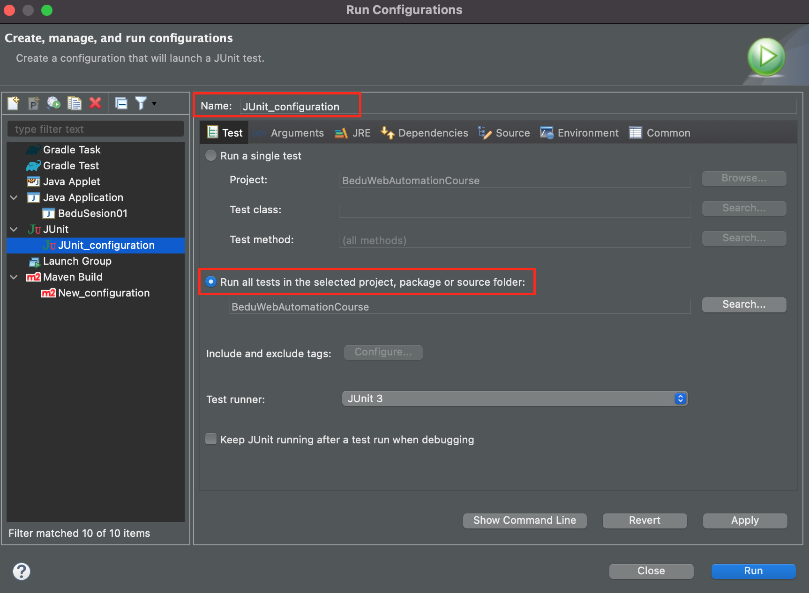
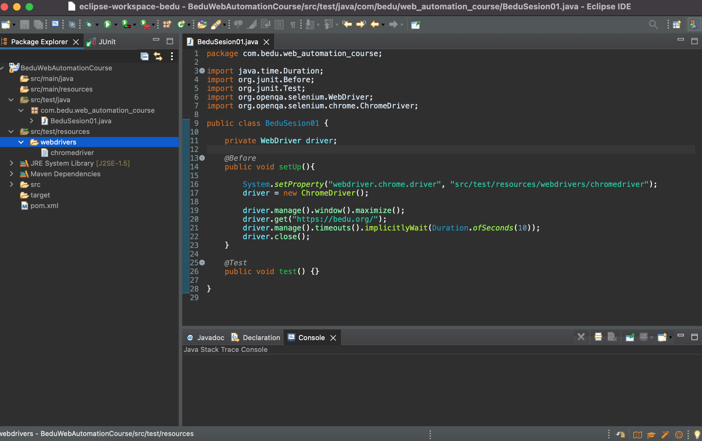

# Instalación y configuración de Selenium Browser Drivers

## Objetivo

* Demostrar el proceso de instalación y configuración de Selenium Browser Drivers

## Desarrollo

#### Descarga de Selenium Browser Drivers :globe_with_meridians:
* Realizar la descarga de los browser drivers con los que vamos a trabajar, momentaneamente solo usaremos firefox y chrome. La descarga se realiza desde la página oficial de selenium: https://www.selenium.dev/documentation/webdriver/getting_started/install_drivers/
  
  > 

  * Para el caso de la descarga de chromedriver, al realizar click en la opcion de descargar veremos una pagina con el directorio de multiples versiones, navegamos en el directorio hasta conseguir la version que corresponde a la versión de chrome que tenemos instalada, ejemplo, si tenemos `chrome version 75.X.X` la version del chromedriver seria la misma.
      > 
      > 

  * Para el caso de la descarga de firefox, nos redirecciona a: https://github.com/mozilla/geckodriver/releases
      > 
      
  * Tanto para Chrome como para Firefox debe descargarse la versión correspondiente a su sistema operativo.
  * Crear una carpeta que se llame "webdriver" y descomprimir los archivos descargados en ella.
  
#### Configuración de Selenium Browser Drivers :globe_with_meridians:

* Creamos una carpeta en en directorio src/test/resource que se llame "webdrivers"
  
  > 

* Hacer click en "Finish"
  
  >

* Ahora sobre la carpeta "webdrivers", hacemos click derecho y seleccionamos la opción de "Importar"
  
  >

* Desplegamos la carpeta General > File System y hacer click en el botón "next"
  
  >

* Buscarmos la carpeta que creamos llamada "webdrivers" e importamos los browser drivers (no los .zip)
  
  >

## Creación de nuestro primer script con Eclipse + Selenium. :nerd_face:

#### Agregamos JUnit para nuestra primera prueba :space_invader:
* Agregamos dependiencia a nuestra libreria pom.xml: https://maven.apache.org/surefire/maven-surefire-plugin/examples/junit.html
* Agregamos la configuración para ejecutar JUnit, ingresamos a la seccion de eclipse RUN > Run Configutation > JUnit
  >
* Hacer click en "Apply"
* Agregar en la clase las siguientes anotaciones de JUnit
`@Before`
`@Test`


#### Creamos un script basico de prueba  :robot:
* Crear el objeto Webdriver con el siguiente comando:  `private WebDriver driver;`. Si hacemos click sobre la lupa veremos la opción de importar la libreria requerida de selenium en nuestra clase.

  >
* Bajo la anotación de `@Before` creamos un metodo que se llame `public void setUp(){}` 
* Bajo la anotación de `@Test` creamos un metodo que se llame `public void test() {}` -> no haremos nada con este metodo por ahora.
* Dentro del metodo que se llame `public void setUp(){}`:
  * Agregar la ubicación del ejecutable de chromedriver con el siguiente comando: `System.setProperty("webdriver.chrome.driver", "./src/test/resourses/webdrivers/chromedriver.exe");` 
  * Declaramos el objeto driver de tipo chromedriver `driver = new ChromeDriver();`. Si hacemos click sobre la lupa veremos la opción de importar la libreria requerida de selenium chromedriver en nuestra clase.
  * Realizamos algunas acciones basicas con el explorador:
   - Maximizamos la pantalla `driver.manage().window().maximize();` 
   - Ingresamos a una url `driver.get("https://bedu.org/");` 
   - Agregamos un tiempo de espera: `driver.manage().timeouts().implicitlyWait(Duration.ofSeconds(10));`
   - Cerramos el navegador `driver.close();` 


  >

<details>
    <summary>Código de la clase</summary>
  
```java
package com.bedu.web_automation_course;
import java.time.Duration;
import org.junit.Before;
import org.junit.Test;
import org.openqa.selenium.WebDriver;
import org.openqa.selenium.chrome.ChromeDriver;

public class BeduSesion01 {
	
	private WebDriver driver;
	
	@Before
	public void setUp(){
		
		System.setProperty("webdriver.chrome.driver", "src/test/resources/webdrivers/chromedriver");
		driver = new ChromeDriver();
		
		driver.manage().window().maximize();
		driver.get("https://bedu.org/");
		driver.manage().timeouts().implicitlyWait(Duration.ofSeconds(10));
		driver.close();
	}
	
	@Test
	public void test() {}

}
  ```
</details>
* Ahora ejecutamos el script, para eso solo basta con hacer click en el botón de "run" de eclipse. :rocket:
