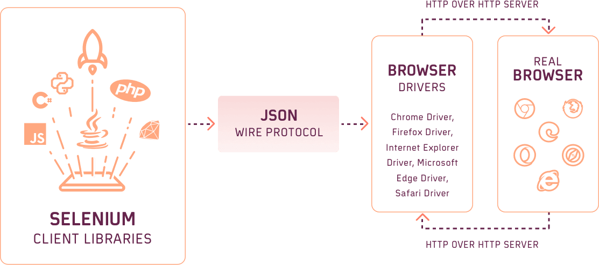

## Sesión 1: Selenium Installation & Setup 🤖

### 1. Objetivos :dart: 

- Establecer la instalación y configurar correctamente Selenium

### 2. Contenido :blue_book:
Selenium es un entorno de pruebas que se utiliza para comprobar si el software que se está desarrollando funciona correctamente, cabe acotar que, con selenium solo se pueden probar las aplicaciones web. Esta herramienta permite: grabar, editar y depurar casos de pruebas que se pueden automatizar. Lo interesante de Selenium es que se pueden editar acciones o crearlas desde cero. También ayuda mucho en las pruebas de regresión porque consigue pruebas automatizadas que luego se pueden reutilizar cuando se necesite. 
  
En esta sesión realizaremos todas las instalaciones y configuraciones necesarias para que selenium funcione de forma correcta. 

---

#### <ins>Tema 1: Instalación de Java Software Development Kit (JDK)</ins>

Un software development kit (SDK) es un conjunto de herramientas que ayudan a desarrollar aplicaciones para hardware o software específicos o en un lenguaje de programación concretos. En algunos lenguajes interpretados, el SDK puede ser idéntico al sistema en tiempo de ejecución. Algunos fabricantes utilizan denominaciones alternativas para sus paquetes de software en lugar de SDK.Oracle, por ejemplo, llama JDK (Java (SE) Development Kit) a su paquete para el lenguaje de programación que distribuye, Java.
  
En esta tema realizaremos la instalacion del Java (SE) Development Kit
  - [Manual Instalación de Java Software Development Kit (JDK)](./Ejemplo-01)

---

#### <ins>Tema 2: Instalación de Eclipse IDE. </ins>
  
Eclipse es un proyecto de código abierto cuyo principal objetivo es proporcionar una plataforma de desarrollo abierta e independiente de los fabricantes de software además de una serie de frameworks para construir software.
    
En esta tema realizaremos la instalacion de Eclipse IDE.
   - [Manual Instalación de de Eclipse IDE](./Ejemplo-02)
  
---

#### <ins>Tema 3: Instalación de Selenium JAVA Cliente Driver + Webdriver</ins>

Es una herramienta que permite interactuar con los navegadores directamente con la ayuda de scripts de automatización. Admite varias plataformas y la ejecución es más rápida que Selenium Remote Control (Selenium RC, que ahora está en desuso) o IDE. Selenium Webdriver proporciona múltiples librerías de clientes para lenguajes de programación como Java, Python, Ruby, C#, etc. para crear los scripts de automatización de pruebas de Selenium. 
  
La comunicación entre estos clientes y el servidor ocurre a través de un protocolo de cable JSON. Por ejemplo: cuando se da un comando para abrir un navegador con una URL específica, toda la información necesaria, como el tipo de navegador, la versión del navegador y las capacidades deseadas, se usará para crear una carga JSON. El cliente enviará esta carga útil que contiene toda la información requerida a través del protocolo JSON al cliente HTTP. Luego, el servidor identificaría el tipo de navegador en el que se debe ejecutar el comando y ejecutaría el comando especificado en ese navegador en particular.
  
  >  
  
En esta tema realizaremos la instalacion de Selenium JAVA Cliente Driver y Selenium Webdriver
  - [Manual Selenium JAVA Cliente Driver y Selenium Webdriver](./Ejemplo-03)

---

#### <ins>Tema 4: Configuración de Eclipse IDE con Selenium WebDriver</ins>

En esta tema realizaremos la configuración de Selenium Webdriver en Eclipse IDE, para que todo este listo para comenzar con la sesión 02.
    - [Manual de configuración de Eclipse IDE con Selenium WebDriver](./Ejemplo-04)

---

### 3. Postwork :memo:

- Instala Java Software Development Kit (JDK), Eclipse IDE y Selenium Java Client & Webdriver en tu maquina.
- Configura Eclipse IDE con Selenium para que tengas todo listo para la proxima sesión!!

 

