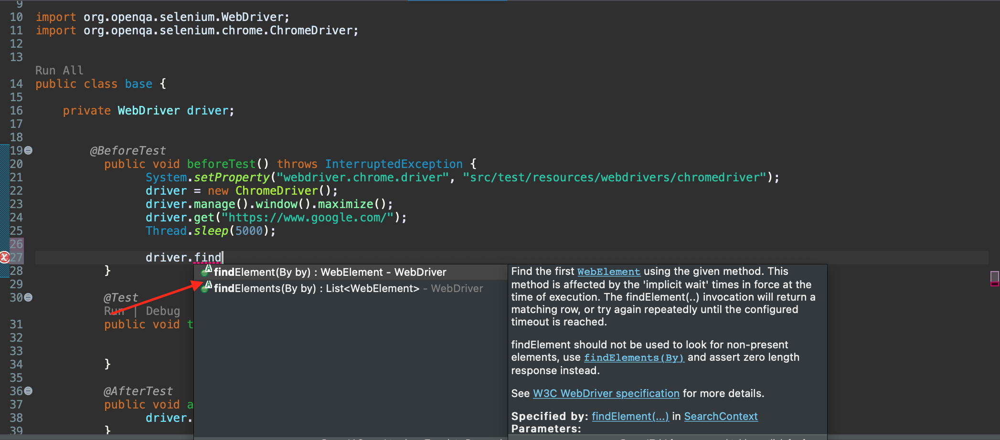

# Ejemplo-02: Localización de elementos con Selenium IDE

## Objetivo

* Emplear los diferentes tipos de localizadores de selenium para identificar la presencia de elementos en la pagina web.

## Desarrollo

Para entrar en el mundo de los localizadores de Selenium tenemos que explicar el concepto de WebElement, la misma es una clase creada para los elementos que componen la página web. Para Selenium WebDriver todos los elementos de una página web (campos de texto, botones, links, imágenes, entre otros..) son WebElements.

Para poder encontrar WebElements en la página web, Selenium utiliza los localizadores que le permite al encontrarlo, ejecutar alguna acción sobre el cómo extraer su contenido, hacer un click, revisar si se encuentra disponible, etc..

Ahora bien, __¿Cómo le indicamos a Selenium qué es lo que debe hacer?__

Esto se realiza con los siguiente comando:

```Java
driver.findElement();
driver.findElements();
```

 

Este es el métodos encargados de devolver el/los WebElement recibiendo como parámetro un localizador (By). 

>**💡 Conoceremos más sobre estos dos metodos en la sesión [**`Find element Vs Find elements`**](Sesion-02/Ejemplo-04)**


#### Tipos de localizadores:

- `By.id("xxxxx")`: El id es el identificador único del elemento. Debido a esto se recomienda siempre que el elemento tenga un id, utilizarlo como primera opción de localización.
- `By.name("xxxxx")`:  busca si el elemento tiene un atributo name determinado. En caso que no tengamos un id y es recomendable usar el name (si lo tiene). Usualmente los nombres de los elementos son únicos y nos permiten ubicar un elemento con facilidad.
- `By.className("xxxxx.class")`: Este localizador se refiere al atributo class del elemento Web.
- `By.tagName("xxxxx")`:  Este localizador busca por el nombre del tag del elemento dentro del DOM(Document Object Model)
- `By.linkText("xxxxx")`:  Este localizador busca links en la página donde el texto coincida con el parámetro que le pasamos al método linkText().
- `By.partialLinkText("xxxxx")`: Este localizador busca links en la página donde el texto coincida parcialmente con el parámetro que le pasamos al método partialLinkText(“string”).
- `By.cssSelector("input[name=’xxxxx’]")`: Este localizador es una estrategia de localización que utiliza el lenguaje CSS para encontrar el elemento.
- `By.xpath("//input[@name='xxxxx']")`: Permite encontrar elementos por su XPATH(es un lenguaje que permite recorrer y procesar los elementos del DOM, por lo que es muy útil para encontrar un WebElement)
