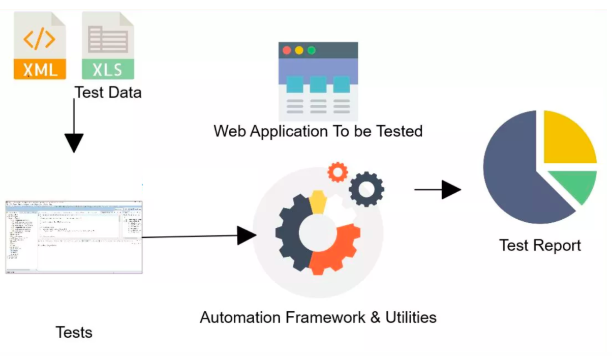

## Sesión 2: Selenium Webdriver: First Steps 🤖 

### 1. Objetivos :dart: 

- Utilizar los elementos del IDE de Selenium webdriver para poder encontrar correctamente los elementos de la aplicación WEB y  poder realizar acciones con ellos,  para lograr scripts automatizados eficientes.
- Utilizar las anotaciones de TestNG para organizar la logica de la ejecución de los casos de prueba.
- Implementar aserciones para validar los resultados esperados de los casos de pruebas automatizados.

### 2. Contenido :blue_book:

Hasta ahora solo hemos podido realizar las configuraciones necesarias para que Selenium funcione en nuestros equipos, y hemos realizado nuestro primer script de prueba. Ahora nos surgen algunas preguntas ¿Que más podemos hacer con esta poderosa herramienta instalada? ¿Por donde comienzo a automatizar? ¿Tengo algunos casos de prueba, ahora que hago?. Y para darle respuestas a todas estas preguntas tenemos que profundizar en las funcionalidades de Selenium que nos permite convertir eso en casos de pruebas automatizadas. Sin embargo, dado que Selenium no admite la ejecución de código en casos de prueba, tenemos que usar TestNG para el mismo. Aquí es donde TestNG encaja en el framework de Selenium. 

Es por ello que en esta sesión nos adentraremos en el uso de TesnNG y Selenium como herramientas para comenzar a automatizar nuestras pruebas sobre plataformas web.  

---

#### <ins>Tema 1: TestNG</ins>

TestNG proviene de las siglas de Test Next Generation y es un framework de automatización de pruebas de código abierto inspirado en JUnit y NUnit que terminó siendo una actualización de esos dos framework, es decir, se fusionaron para obtener un framework mucho más completo, que resolviera los problemas a los que los 2 anteriores no les daba solución.

TestNG facilita el desarrollo de pruebas de software en Java, ya que ejecuta las pruebas en clases, es decir, hace clases para las pruebas correspondientes y luego las procesa. Una novedad es que proporciona una funcionalidad adicional como anotaciones de prueba, agrupación, priorización, parametrización y técnicas de secuenciación en el código que no era posible antes, además de administrar los casos de prueba, incluso los informes detallados de las pruebas se pueden obtener utilizando TestNG. 

 

- [**`EJEMPLO 1 - TestNG`**](./Ejemplo-01)

---

#### <ins>Tema 2: Localización de elementos con Selenium IDE</ins>

Para entrar en el mundo de los localizadores de Selenium tenemos que explicar el concepto de WebElement, la misma es una clase creada para los elementos que componen la página web. Para Selenium WebDriver todos los elementos de una página web (campos de texto, botones, links, imágenes, entre otros..) son WebElements.

Para poder encontrar WebElements en la página web, Selenium utiliza los localizadores que le permite al encontrarlo, ejecutar alguna acción sobre el cómo extraer su contenido, hacer un click, revisar si se encuentra disponible, etc..

 

- [**`EJEMPLO 2 - Localización de elementos con Selenium IDE`**](./Ejemplo-02)
- [**`RETO 1`**](./Reto-01)
---

#### <ins>Tema 3: Trabajando con Esperas, Condiciones y Manejo de excepciones</ins>

 

- [**`EJEMPLO 3 - Trabajando con Esperas, Condiciones y Manejo de excepciones`**](./Ejemplo-03)
- [**`RETO 2`**](./Reto-02)
---

 

#### <ins>Tema 4: Find element Vs Find elements</ins>

 

- [**`EJEMPLO 4 - Find element Vs Find elements`**](./Ejemplo-04)

---

#### <ins>Tema 5: Clase Webdriver y WebElement</ins>

 

- [**`EJEMPLO 5 - Clase Webdriver y WebElement`**](./Ejemplo-05)

---

#### <ins>Tema 6: Validaciones o Aserciones</ins>

 

- [**`EJEMPLO 6  - Validaciones o Aserciones`**](./Ejemplo-06)

---

### 3. Postwork :memo:

Encuentra las indicaciones y consejos para reflejar los avances de tu proyecto de este módulo.

- [**`POSTWORK SESIÓN 2`**](./Postwork/)

 

