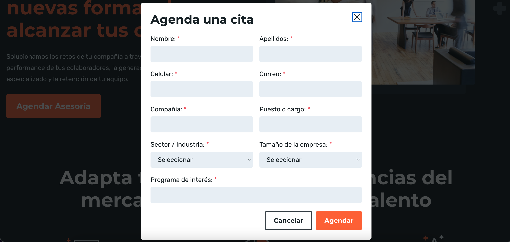

# Reto 2 # - Mejorar clase agendarCitaPage

## Objetivo

* Crear una clase tipo Object Page que se encarge de manejar el driver

## Desarrollo

Agregar mas metodos y localizadores en la clase `agendarCitaPage`, para incluir mas casos de prueba, ten en cuenta que de esta pagina solo se contemplo el botón de "Cancelar"

 

```Java
package pages;

import java.time.Duration;

import org.openqa.selenium.By;
import org.openqa.selenium.WebDriver;
import org.openqa.selenium.WebElement;
import org.openqa.selenium.support.ui.ExpectedConditions;
import org.openqa.selenium.support.ui.WebDriverWait;

public class agendarCitaPage {
	
	/**
	 * Page Object Model (POM) para página de Agendar cita bedu
	 */
	
	protected WebDriver driver;

	  // Definimos objetos de tipo locator y le asignamos la localización By.
	  private By bnt_cancelar = By.xpath("//button[contains(.,'Cancelar')]");

	  // Creamos el método que recibirá el driver en esta clase
	  public agendarCitaPage(WebDriver driver){
	    this.driver = driver;
	  }

	  /**
	    * Creamos el método de login que cancelara la  asesoria   
	    * y retorna un objeto HomePage
	    */
	  public HomePage cancelarAsesoria() {
	    driver.findElement(bnt_cancelar).click();
	    return new HomePage(driver);
	  }
	  
	  public String btnIsDispayed() {
		    WebElement bnt_cancelar = new WebDriverWait(driver, Duration.ofSeconds(10))
		            .until(ExpectedConditions.elementToBeClickable(By.xpath("//button[contains(.,'Cancelar')]"))); 
		    return bnt_cancelar.getText();
		  }

}

```


