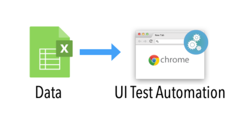
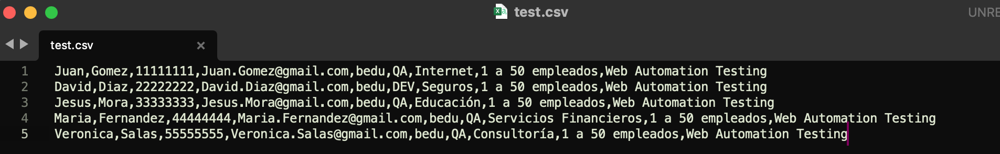

# Ejemplo-02:# - Archivos csv como origen de Datos.

## Objetivo

* Hacer uso de archivos con extensión .csv como fuente de origen de datos para los scripts de pruebas automatizados.

## Desarrollo

La lectura de datos de prueba de archivos con extensiones `.CSV` es una de las formas más comunes en los frameworks híbridos. Es por ello que en este tema vamos a realizar una `Prueba basada en datos utilizando un archivo CSV en Selenium WebDriver`, lo cual  es un requisito importante para cualquier organización el utilizar algún tipo de enfoque basado en datos.

 

#### ¿Qué es un archivo CSV?

Las siglas CSV vienen del inglés `Comma Separated Values` y significan valores separados por comas. Dicho esto, un archivo CSV es cualquier archivo de texto en el cual los caracteres están separados por comas, haciendo una especie de tabla en filas y columnas. Las columnas quedan definidas por cada punto y coma (;), mientras que cada fila se define mediante una línea adicional en el texto.

#### Pasos para configurar la lectura de fuente de datos csv en el proyecto de selenium:

#### Agregar Dependencia POM.xml ->  opencsv
Lo primero que hay que hacer es agregar a nuestro archivo POM.xml la dependencia:

```xml
	<!-- https://mvnrepository.com/artifact/com.opencsv/opencsv -->
	<dependency>
	    <groupId>com.opencsv</groupId>
	    <artifactId>opencsv</artifactId>
	    <version>5.6</version>
	</dependency>
```

Esta dependencia nos permitirá leer el archivo csv que usaremos como insumo en los casos de prueba.

Ejemplo del archivo `pom.xml`: 
```xml
<project xmlns="http://maven.apache.org/POM/4.0.0" xmlns:xsi="http://www.w3.org/2001/XMLSchema-instance" xsi:schemaLocation="http://maven.apache.org/POM/4.0.0 https://maven.apache.org/xsd/maven-4.0.0.xsd">
  <modelVersion>4.0.0</modelVersion>
  <groupId>com.bedu.web_automation_course</groupId>
  <artifactId>BeduWebAutomationCourse</artifactId>
  <version>0.0.1-SNAPSHOT</version>

  <dependencies>
	<!-- https://mvnrepository.com/artifact/org.seleniumhq.selenium/selenium-java -->
	<dependency>
	    <groupId>org.seleniumhq.selenium</groupId>
	    <artifactId>selenium-java</artifactId>
	    <version>4.1.2</version>
 		<scope>test</scope>
	</dependency>
    
	<!-- https://mvnrepository.com/artifact/org.testng/testng -->
	<dependency>
	    <groupId>org.testng</groupId>
	    <artifactId>testng</artifactId>
	    <version>7.4.0</version>
	    <scope>test</scope>
	</dependency>

	<!-- https://mvnrepository.com/artifact/com.opencsv/opencsv -->
	<dependency>
	    <groupId>com.opencsv</groupId>
	    <artifactId>opencsv</artifactId>
	    <version>5.6</version>
	</dependency>
  </dependencies>
</project>
```
#### Generación del archivo CSV

Ahora debemos generar nuestro archivo csv, para esto usamos el programa Sublime Text, colocando en la primera línea el nombre del campo separados por coma “,” y el las filas los valores de los campos, separados igualmente por coma.

     

> __Cuidado:__ El formato de los archivos csv es .csv, sin este formato no reconocerá el archivo.

#### Creación de la clase de prueba:
Este es un ejemplo de una clase con pruebas de ingreso de información para agendar una asesoria en la pagina https://bedu.org/


Al ejecutar esta clase obtendremos que los datos del csv fueron tomados correctamente, por lo que con esta integración podremos usar este tipo de archivos en nuestros scripts de pruebas.