# Ejemplo-01 # - Creación y conexión de Base de Datos

## Objetivo

- Enseñar el procedimiento para instalación y configuración de MySQL y MySQL Workbench.
- Desarrollar los comandos MySQL para la creación de: esquemas, bases de datos, tablas y registros de bases de datos.
- Construir mediante el uso de la librería JDBC para Mysql la conexión entre las bases de datos y los scripts de pruebas de Selenium.

## Desarrollo


#### ¿Qué es una base de datos?

Una base de datos es una `recopilación organizada de información o datos estructurados, que normalmente se almacena de forma electrónica en un sistema informático`. Normalmente, una base de datos está controlada por un `sistema de gestión de bases de datos (DBMS)`. En conjunto, los datos y el DBMS, junto con las aplicaciones asociadas a ellos, reciben el nombre de sistema de bases de datos, abreviado normalmente a simplemente `base de datos`.

Los datos de los tipos más comunes de bases de datos en funcionamiento actualmente se suelen utilizar como estructuras de filas y columnas en una serie de tablas para aumentar la eficacia del procesamiento y la consulta de datos. Así, se puede acceder, gestionar, modificar, actualizar, controlar y organizar fácilmente los datos. La mayoría de las bases de datos utilizan un lenguaje de consulta estructurada (SQL) para escribir y consultar datos.


#### ¿Por qué necesitamos la automatización de la base de datos?

Hay múltiples razones para querer utilizar una base de datos como fuente origen de datos en nuestros casos de prueba, e incluso utilizarla como fuente de información para validación de resultados, pero acá mencionamos las 3 razones más importantes para querer utilizarlas en nuestras automatizaciones de pruebas:

- `Datos de prueba`: podemos almacenar los datos en la base de datos en lugar de excel o propiedades, archivos JSON/xml, la recuperación sería más rápida en el caso de la base de datos si estamos tratando de obtener un gran conjunto de datos.

- `Conectividad de front-end y back-end`: a veces tenemos que verificar que los detalles que enviamos/eliminamos/actualizamos en el front-end llegan al back-end para fines de uso futuro. Hay escenarios en los que los detalles pueden fallar durante el análisis; en tales casos, los detalles no llegarán a la base de datos.

- `Pruebas más rápidas`: si estamos probando tareas simples de la base de datos manualmente, puede llevar mucho tiempo y esfuerzo, por lo que para evitar eso, podemos optar por la prueba de automatización de la base de datos.


#### ¿Qué es el lenguaje de consulta estructurada (SQL)?

El `SQL es un lenguaje de programación` que utilizan casi todas las bases de datos relacionales para consultar, manipular y definir los datos, además de para proporcionar control de acceso. El `SQL` se desarrolló por primera vez en IBM en la década de 1970 con Oracle como uno de los principales contribuyentes, lo que dio lugar a la implementación del estándar ANSI SQL. El SQL ha propiciado muchas ampliaciones de empresas como IBM, Oracle y Microsoft. Aunque el SQL se sigue utilizando mucho hoy en día, están empezando a aparecer nuevos lenguajes de programación.

#### ¿Qué es una base de datos MySQL?

`MySQL` es un sistema de gestión de bases de datos relacionales de código abierto basado en SQL. Se diseñó y se optimizó para las aplicaciones web y puede utilizarse en cualquier plataforma. A medida que surgían nuevos y diferentes requisitos con Internet, MySQL se convirtió en la plataforma preferida por los desarrolladores web y las aplicaciones basadas en web. Dado que está diseñado para procesar millones de consultas y miles de transacciones, MySQL es una elección popular para las empresas de comercio electrónico que necesitan gestionar múltiples transferencias de dinero. La flexibilidad on-demand es la principal función de MySQL.

MySQL es el DBMS que se encuentra detrás de algunos de los sitios web y aplicaciones basadas en web más importantes del mundo, como `Airbnb`, `Uber`, `LinkedIn`, `Facebook`, `Twitter` y `YouTube`.

#### Mysql Community Server Instalación

1. Ingresar a la url: https://dev.mysql.com/downloads/mysql/
2. Selecciona tu sistema operativo
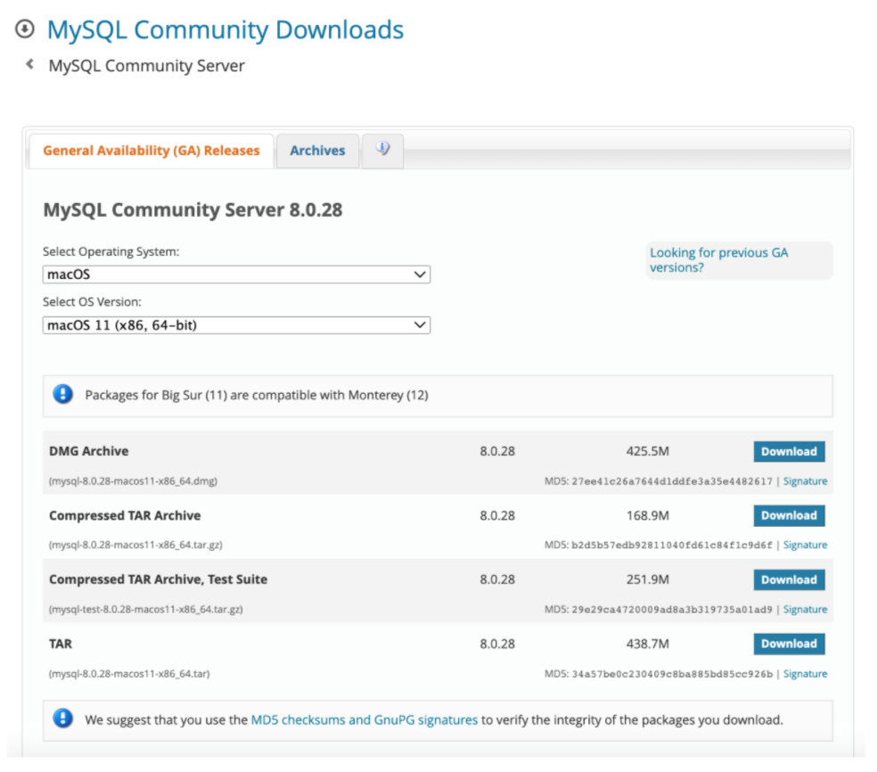 

3. Haz clic en descargar.
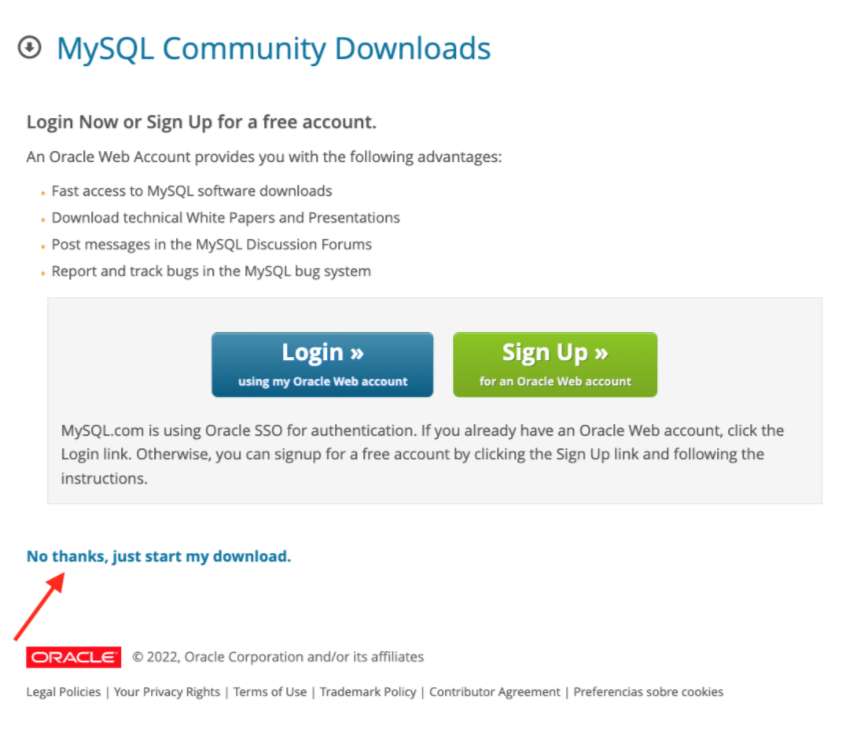 

4. En la siguiente pantalla haz clic en: `No thanks, just start my download.`
5. Sigue los pasos de la instalación
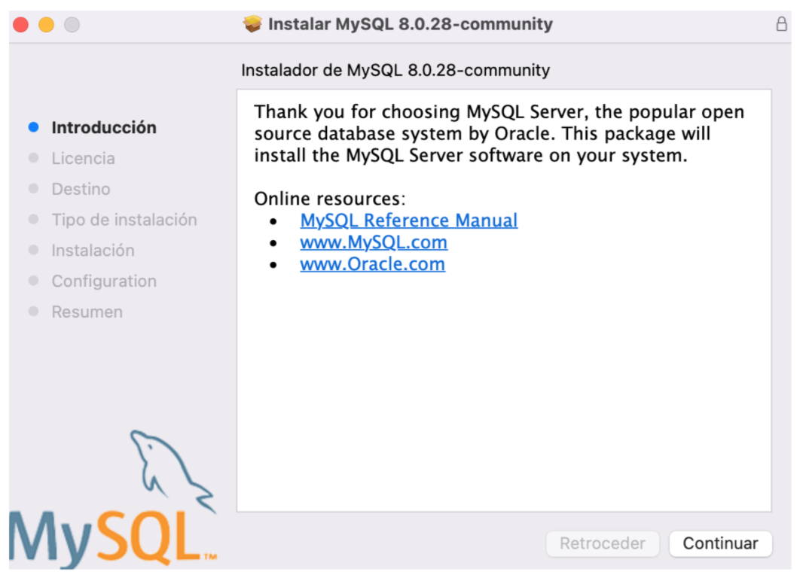 

6. En la siguiente pantalla te solicitará ingresar una contraseña para el usuario root. `Pro-tip`: usa una contraseña que no olvides ya que en algunos casos se te solicitara.
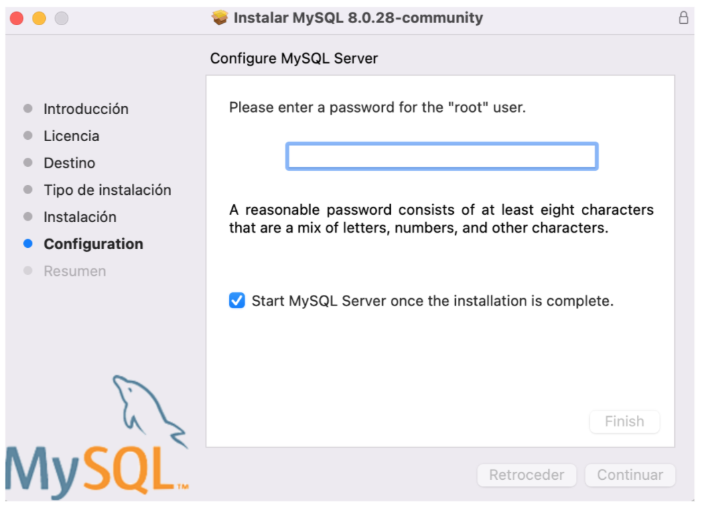 

7. Haz clic en finalizar
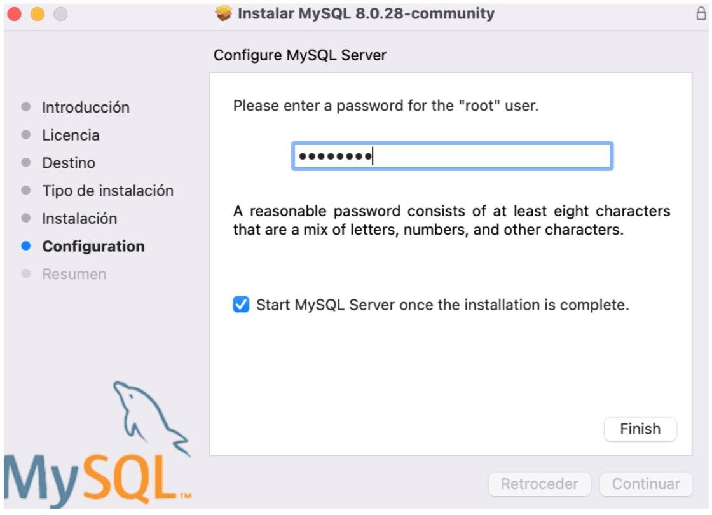 


#### Mysql Workbench instalación
1. Ingresar en la url: https://dev.mysql.com/downloads/workbench/
2. Selecciona tu sistema operativo.
3. Haz clic en descargar.
4. En la siguiente pantalla haz clic en: `No thanks, just start my download.`
5. Sigue los pasos de la instalación de Mysql Workbench


#### Creación de base de datos

1. Abrir Mysql Workbench y hacer click en la instancia local
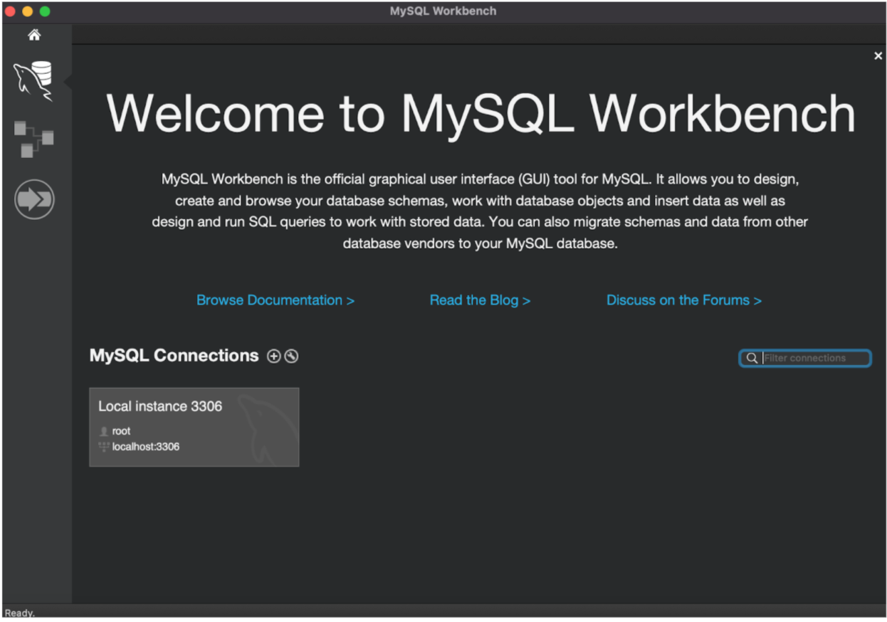 

2. Ingresar la contraseña del usuario root (fue definida en el proceso de instalación de mysql)
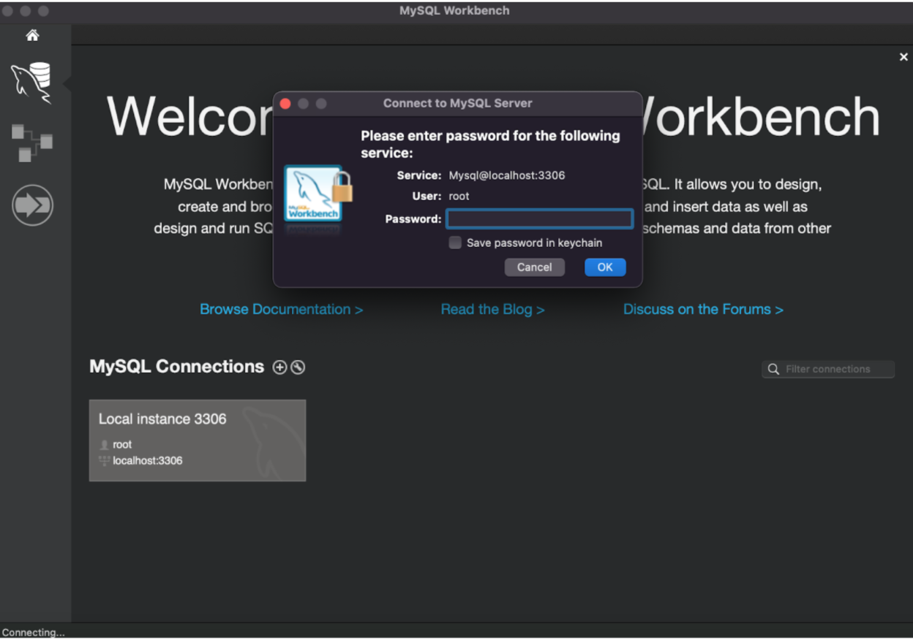 
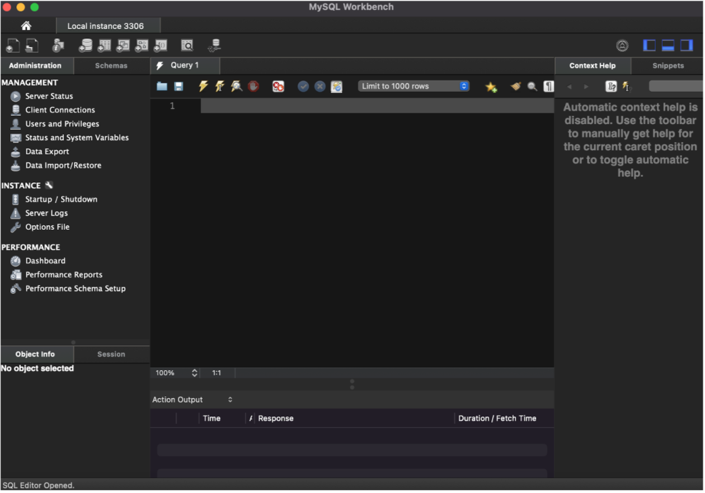 

3. Creación del Schema  por medio de query con la siguiente Syntax

```SQL
CREATE SCHEMA schema_name;
```

4. Creación de la base de datos por medio de query con la siguiente Syntax

```SQL
CREATE DATABASE databasename;
```

5. Salir a la pantalla home de Mysql Workbench y hacer click en el botón `+` en la sección de `Mysql Connections.`
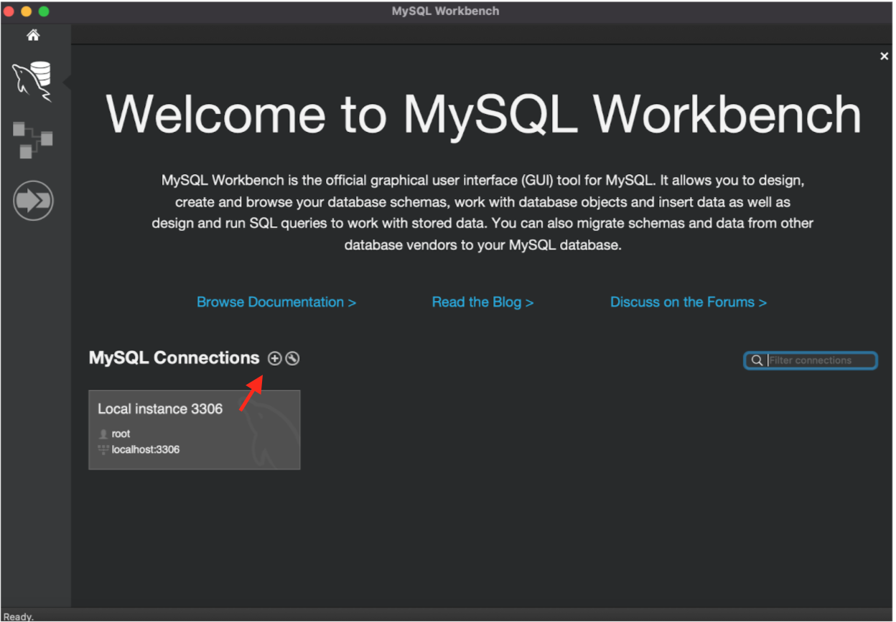 

6. Ingresar los datos del schema y colocarle un nombre a la conexión en la siguiente pantalla:
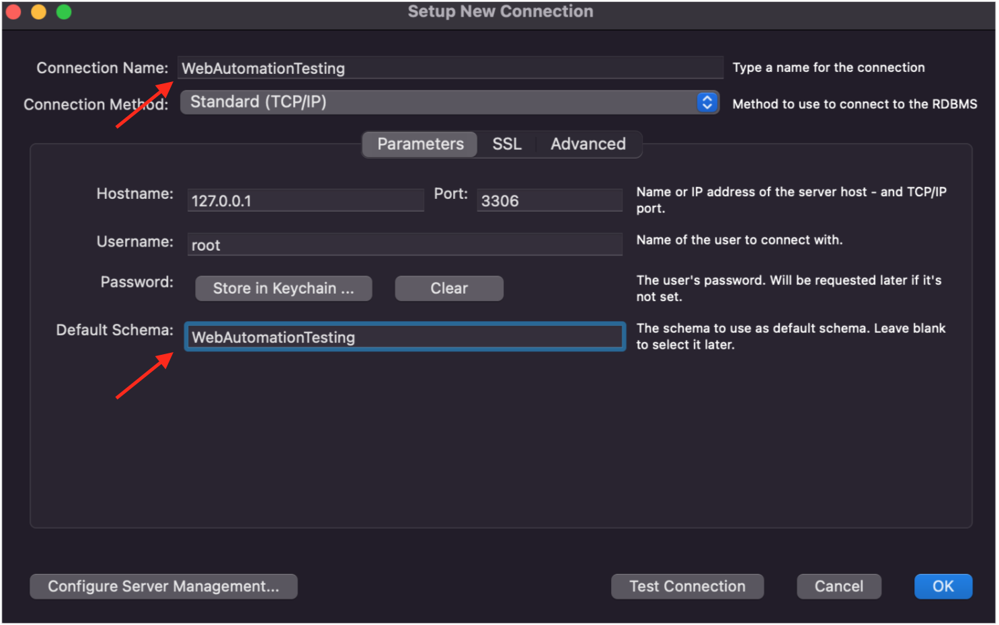 

7. Finalmente nos solicitara nuevamente la contraseña `root`
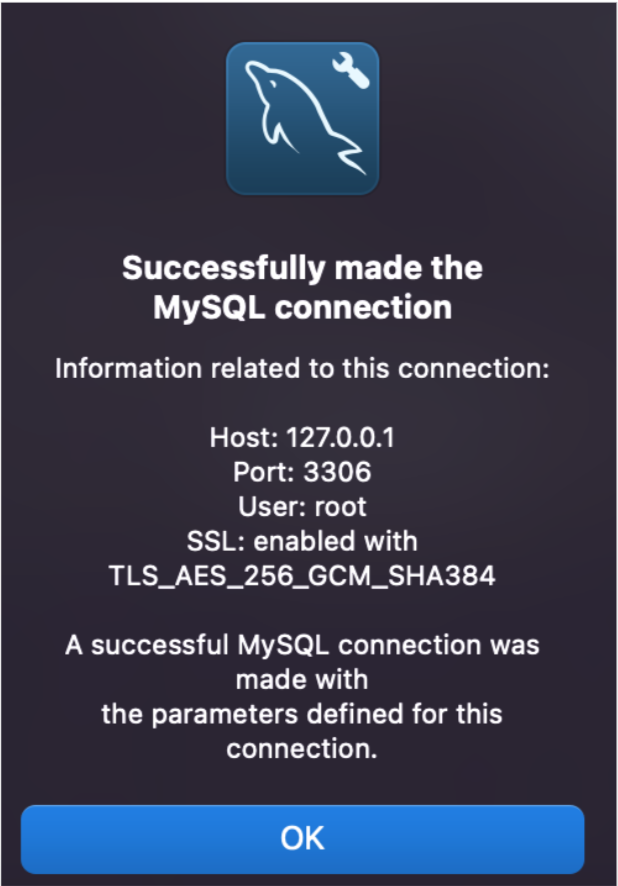 

8. Creación de una tabla por medio de query con la siguiente Syntax:

```SQL
CREATE TABLE table_name (
	column1 datatype,
	column2 datatype,
	column3 datatype,
   ....
);
```

> Ejemplo:

```SQL
CREATE TABLE Persons (
	PersonID int,
	LastName varchar(255),
	FirstName varchar(255),
	Address varchar(255),
	City varchar(255)
);
```

9. Creación de registros en la tabla por medio de query con la siguiente Syntax:

```SQL
INSERT INTO table_name (column1, column2, column3, ...)
VALUES (value1, value2, value3, ...);
```

> Ejemplo:

```SQL
INSERT INTO Persons (PersonID, LastName, FirstName, Address, City)
VALUES ('1', 'Gomez', 'Alejandro', 'Buenos Aires 3456', 'Argentina')
```

#### Conexión a la base de datos con Selenium

1. Ingresar la dependencia al archivo POM.xml https://mvnrepository.com/artifact/mysql/mysql-connector-java

```XML
<!-- https://mvnrepository.com/artifact/mysql/mysql-connector-java -->
<dependency>
    <groupId>mysql</groupId>
    <artifactId>mysql-connector-java</artifactId>
    <version>8.0.28</version>
</dependency>
```

2. Crea una clase llamada DataDrivenTestingUsingDataBase

```Java

```

`Pro-tip`: en este ejemplo debes colocar la contraseña de tu usuario root.

En conclusión la conexión a la base de datos se hace mediante la librería JDBC para mysql:

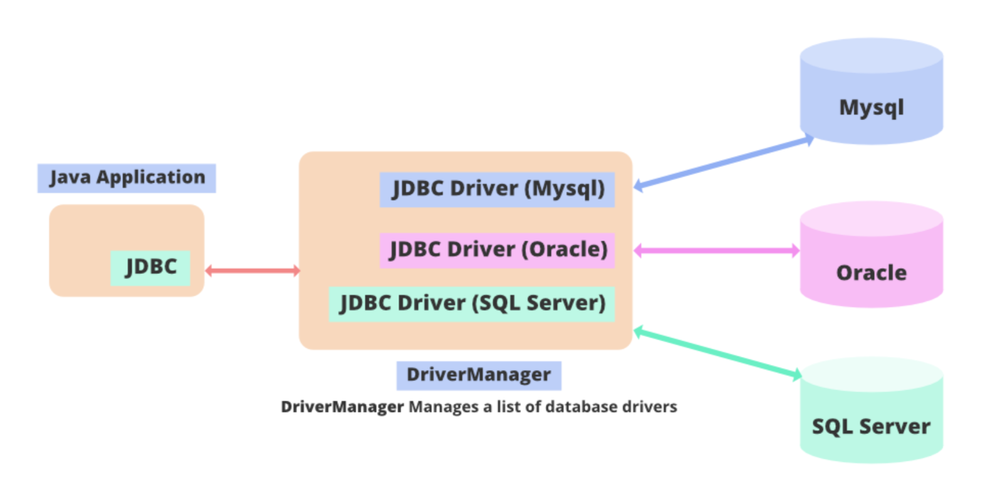 

Haciendo posible que la clase java se conecte a la base de datos, recupere datos de la base de datos o, de hecho, realice cualquiera de las operaciones `CRUD (Create, Read, Update, Delete)` , manipule los datos resultantes y cierre la conexión. Mediante los siguientes pasos:

1. Conexión a la base de datos utilizando el método.

```Java
public static String DB_URL = "jdbc:mysql://localhost:3306/db_name";
public static String DB_USER = "root";
public static String DB_PASSWORD = "root_pass";
String dbClass = "com.mysql.cj.jdbc.Driver";
Class.forName(dbClass);
Connection con = DriverManager.getConnection(DB_URL, DB_USER, DB_PASSWORD);
```

> DB_PASSWORD debe contener la contraseña del usuario root configurado en la instalación de MySQL.

2. Consulta a la base de datos utilizando el objeto de Statement.

```Java
stmt = con.createStatement();
```
