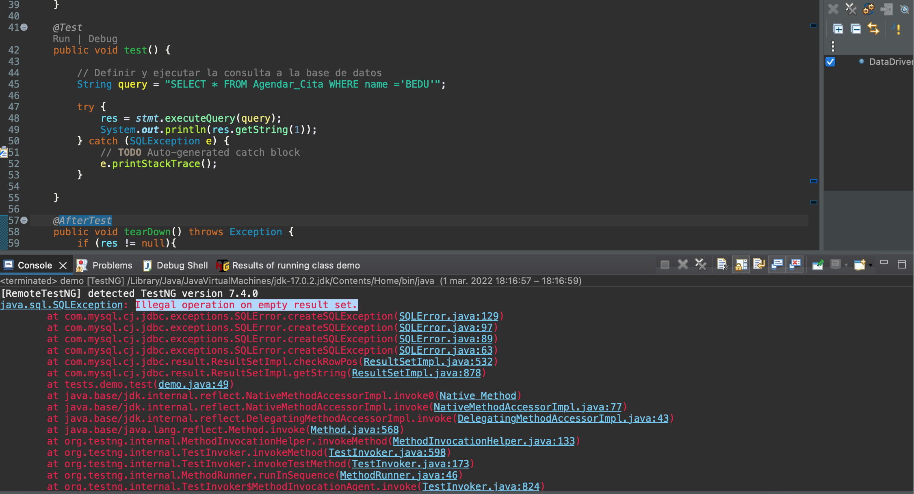

# Reto 1# - Método executeQuery()

## Objetivo

* Probar la clase `DataDrivenTestingUsingDataBase`para deducir el comportamiento del método `executeQuery()`

## Desarrollo

Copia el contenido de la siguiente clase en tu proyecto, y ejecutala:
> ¡Cuidado!: recuerda actualizar el codigo con la contraseña del user root.

```Java
package tests;

import java.sql.Connection;
import java.sql.DriverManager;
import java.sql.ResultSet;
import java.sql.SQLException;
import java.sql.Statement;
import org.testng.annotations.AfterTest;
import org.testng.annotations.BeforeTest;
import org.testng.annotations.Test;

public class demo {
	// Creación del object de conexión
	static Connection con = null;
	private ResultSet res;

	// Creación del object Statement
	private static Statement stmt;

	// Creación de Constantes para la conexión a la Base de Datos
	public static String DB_URL = "jdbc:mysql://localhost:3306/WebAutomationTesting";
	public static String DB_USER = "root";
	public static String DB_PASSWORD = "cmora142";

	@BeforeTest
	public void setUp() throws Exception {
		try {
			// Conexión a la Base de Datos
			String dbClass = "com.mysql.cj.jdbc.Driver";
			Class.forName(dbClass);
			Connection con = DriverManager.getConnection(DB_URL, DB_USER, DB_PASSWORD);

			// Statement object para enviar la declaración SQL a la base de datos
			stmt = con.createStatement();

		} catch (Exception e) {
			e.printStackTrace();
		}
	}

	@Test
	public void test() {

		// Definir y ejecutar la consulta a la base de datos
		String query = "SELECT * FROM Agendar_Cita WHERE name ='BEDU'";

		try {
			res = stmt.executeQuery(query);
			System.out.println(res.getString(1));
		} catch (SQLException e) {
			// TODO Auto-generated catch block
			e.printStackTrace();
		}

	}

	@AfterTest
	public void tearDown() throws Exception {
		if (res != null){
            res.close();
        }
		// Cerrar la conexión a la base de datos
		if (con != null) {
			con.close();
		}
		
	}

}

```

¿Puedes identificar el error?

<details>
  <summary> Solución </summary>

> El resultado de la ejecución del Query no arroja resultado, es por ello que cuando intenta ejecutar el metodo `getString` genera una `java.sql.SQLException`

 

</details>


