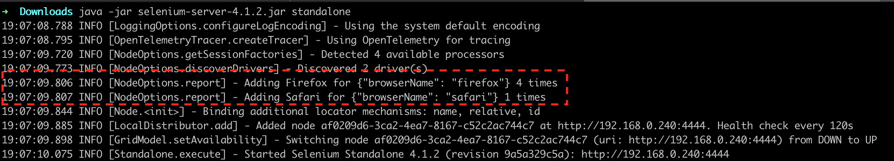
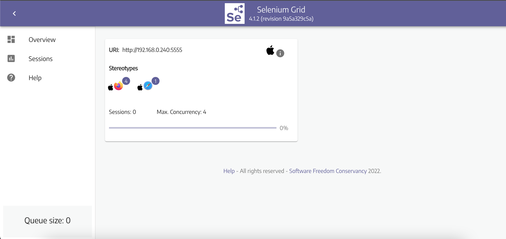
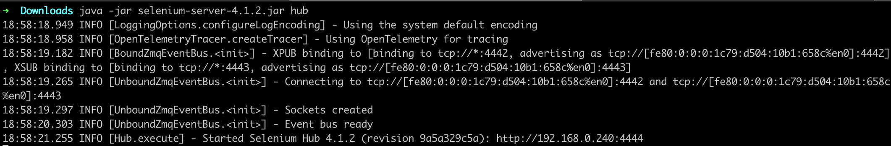
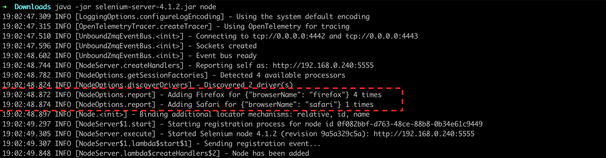
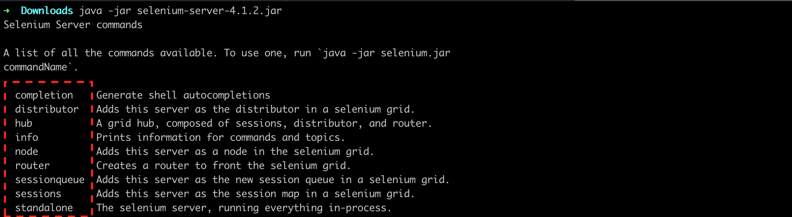

# Ejemplo-03# - Instalación y configuración de Selenium Grid 4

## Objetivo

* Agregar los objetivos del ejemplo (Mínimo agregar 2 objetivos y Borrar está linea una vez se hay leido)

## Desarrollo

#### Roles Selenium Grid

Los roles de Selenium Grid depende de las necesidades que se tengan de los componentes que ofrece Selenium Grid, ya que se puede iniciar cada uno de ellos por separado o varios al mismo. Veremos los 3 roles que ofrece Selenium Grid 4:

`STANDALONE` 
Es la unión de todos los componentes y, a los ojos del usuario, se ejecutan como uno solo. Un Grid de uno completamente funcional está disponible después de iniciarlo en el modo `Independiente (independiente)`. De forma predeterminada, el servidor escuchará en http://localhost:4444, y esa es la URL a la que debe apuntar las pruebas de `RemoteWebDriver`. 

Para iniciar el `standalone` se utilizar el siguiente comando en la terminal de la maquina: `java -jar selenium-server-<version>.jar standalone` ejemplo: `java -jar selenium-server-4.1.2.jar standalone`

Al ir a la pagina: http://localhost:4444/ui/index.html#/ veremos lo siguiente:

> `Pro-tip:` Este es el modo más fácil de hacer girar un Selenium Grid. 

`HUB & NODE(s)` 

Habilita la configuración clásica de Hub y Node(s). Estos roles son adecuados para Grids pequeños y medianos. Al igual que el rol de `standalone`, dee forma predeterminada el servidor escuchará en http://localhost:4444, y esa es la URL a la que debe apuntar slasus pruebas de `RemoteWebDriver`.

- Un `Hub` es la unión de los siguientes componentes:
    - Enrutador
    - Distribuidor
    - Mapa de sesión
    - Cola de nueva sesión
     - Autobús de eventos

Para iniciar el `Hub` se utilizar el siguiente comando en la terminal de la maquina: `java -jar selenium-server-<version>.jar hub` ejemplo: `java -jar selenium-server-4.1.2.jar hub`

- Se pueden iniciar `uno o más nodos` en esta configuración, y el servidor detectará los controladores disponibles que puede usar desde la ruta del sistema.

Para iniciar el `Node` se utilizar el siguiente comando en la terminal de la maquina: `java -jar selenium-server-<version>.jar node` ejemplo: `java -jar selenium-server-4.1.2.jar node`

Al ir a la pagina: http://localhost:4444/ui/index.html#/ veremos lo siguiente:

`DISTRIBUTED (Distribuido)` 

En el modo Distribuido, cada componente debe iniciarse por sí solo. Esta configuración es más adecuada para Grids grandes.

Aca estan todos los componentes que deben iniciarse en el rol de distribuido:

- `Event Bus:` utilizar el siguiente comando en la terminal de la maquina: `java -jar selenium-server-<version>.jar event-bus` ejemplo: `java -jar selenium-server-4.1.2.jar event-bus`

- `Session Map:` utilizar el siguiente comando en la terminal de la maquina: `java -jar selenium-server-<version>.jar  sessions` ejemplo: `java -jar selenium-server-4.1.2.jar sessions`

- `New Session Queue:` utilizar el siguiente comando en la terminal de la maquina: `java -jar selenium-server-<version>.jar  sessionqueue` ejemplo: `java -jar selenium-server-4.1.2.jar sessionqueue`

- `Distributor:` utilizar el siguiente comando en la terminal de la maquina: `java -jar selenium-server-<version>.jar distributor --sessions http://localhost:5556 --sessionqueue http://localhost:5559 --bind-bus false` ejemplo: `java -jar selenium-server-4.1.2.jar distributor --sessions http://localhost:5556 --sessionqueue http://localhost:5559 --bind-bus false`

- `Router:` utilizar el siguiente comando en la terminal de la maquina: `java -jar selenium-server-<version>.jar router --sessions http://localhost:5556 --distributor http://localhost:5553 --sessionqueue http://localhost:5559` ejemplo: `java -jar selenium-server-4.1.2jar router --sessions http://localhost:5556 --distributor http://localhost:5553 --sessionqueue http://localhost:5559`

- `Node(s):` utilizar el siguiente comando en la terminal de la maquina: `java -jar selenium-server-<version>.jar node` ejemplo: `java -jar selenium-server-4.1.2.jar node`

> El orden de inicio de los componentes no es importante, siempre que se inicien todos correctamente.
