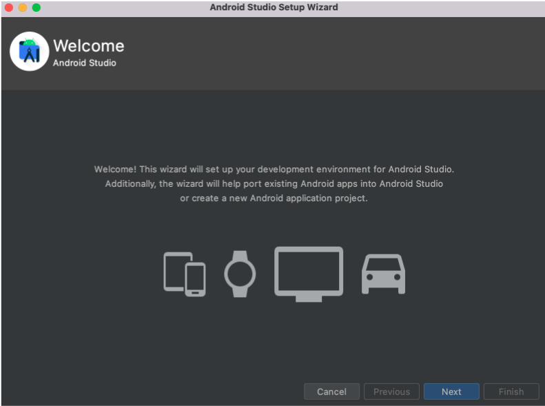
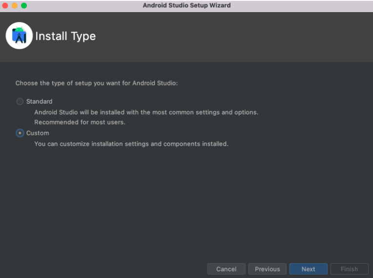
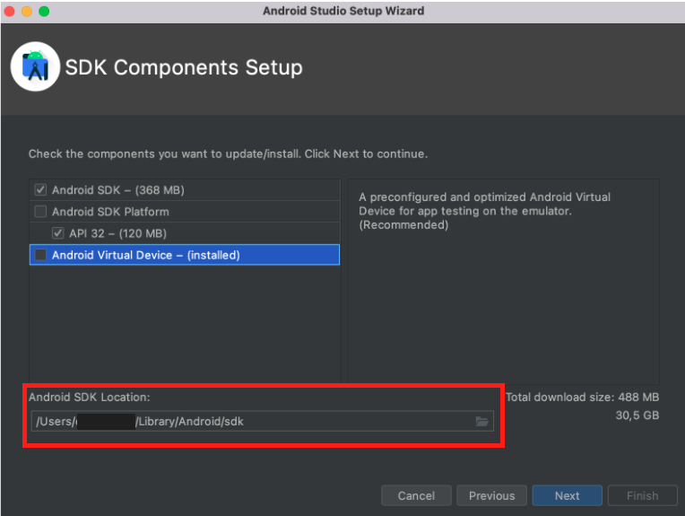
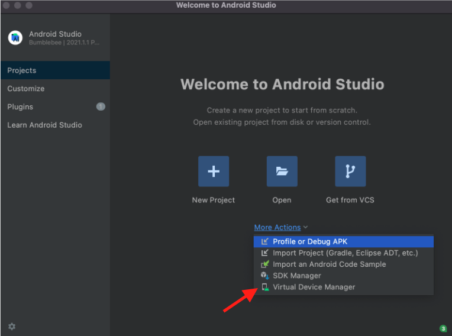
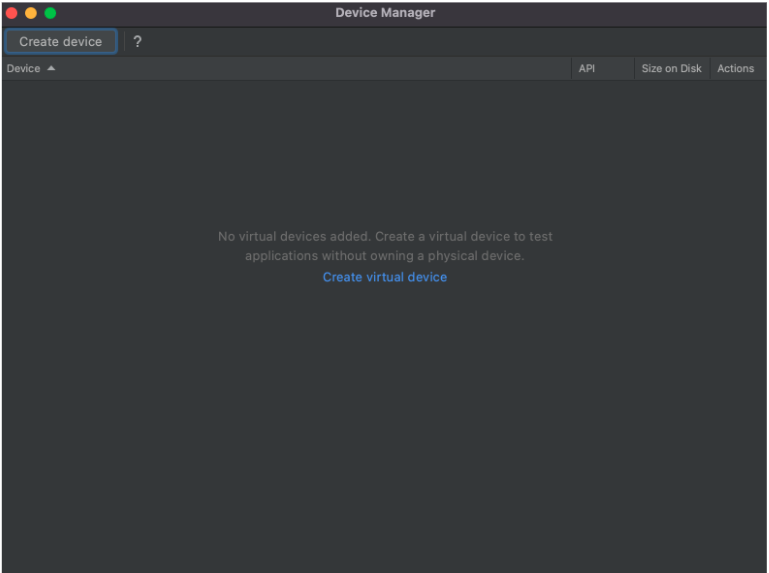
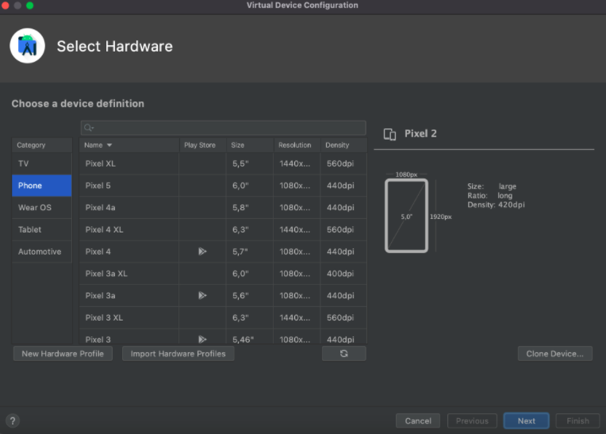
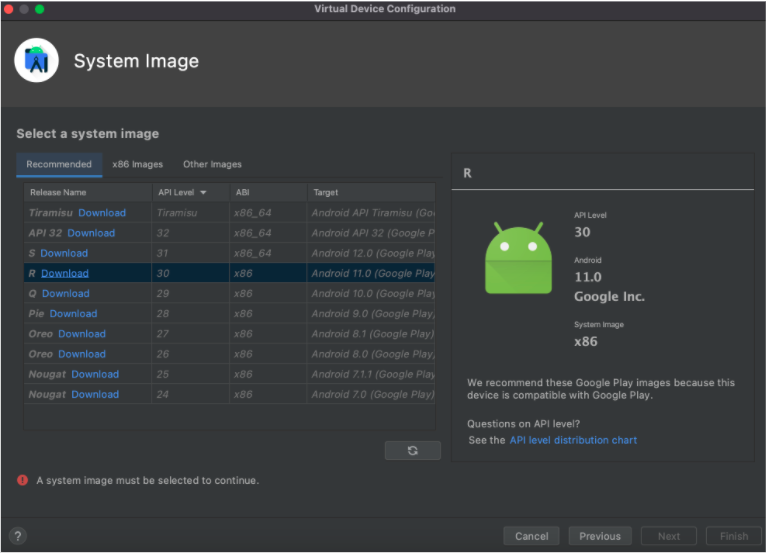
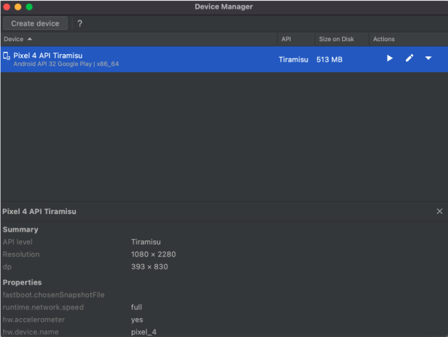
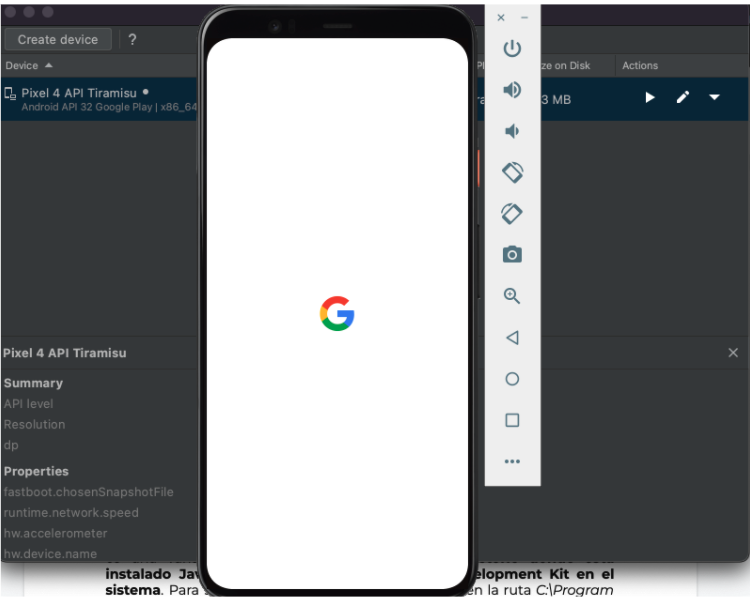

# Ejemplo-03 # - Instalación de Appium & Emuladores.

## Objetivo

- Explicar el proceso de instalación de Appium, Emuladores y variables en entornos requeridas paras las pruebas en plataformas moviles.

## Desarrollo

#### :round_pushpin: DISPOSITIVO VIRTUAL ANDROID (AVD)

Un `dispositivo virtual de Android (AVD)` es una configuración que define las características de un teléfono o una tablet Android, o de un dispositivo Wear OS, Android TV o Automotive OS, que deseas simular en Android Emulator. 

El Administrador de dispositivos es una interfaz que puedes iniciar desde `Android Studio` y te permite crear y administrar los AVD.

Un AVD contiene un perfil de hardware, una imagen del sistema, un área de almacenamiento y una máscara, entre otras propiedades.

Para crear un dispositivo virtual se debe realizar lo siguiente:

1. Descargar android studio https://developer.android.com/studio
2. Sigue el proceso de instalación
     
3. Selecciona la opción "custom"
     
4. En esta pantalla copia el path de la locación de la SDK de android, ya que lo requerirá para configurar la variable de ambiente de `ANDROID_HOME` más adelante.
     
5. Una vez finalizada en instalación, en la pantalla principal de android seleccionar la opción `“Virtual Device Manager”`
     
6. Realizar click en `"Create un virtual device"`
     
7. Selecciona el dispositivo que quieras emular de la lista (se recomienda los que tienen el simbolo de google play)
     
8. Descarga el la versión de android que quieras tener instalada en el dispositivo virtual
     
9. Al finalizar la instalación veremos la siguiente pantalla
     
10. Al clickear en el botón de play se abrirá el AVD creado
     

    
#### :round_pushpin: VARIABLES DE ENTORNO (`JAVA_HOME` y `ANDROID_HOME`)

¿Què son variables de entorno?

`Appium necesitará consumir las variables de entorno JAVA_HOME y ANDROID_HOME` por lo que siguiendo estos pasos podrás configurarlas

ANDROID_HOME: android sdk location

#### :round_pushpin: ANDROID ADB

El nombre de la variable va a ser “ANDROID_HOME” y el valor va a ser la ruta donde fue instalado nuestras versiones de Andriod, se puede visualizar en el “Android SDK Manager”

#### :round_pushpin: Configuración de Entorno APPIUM
