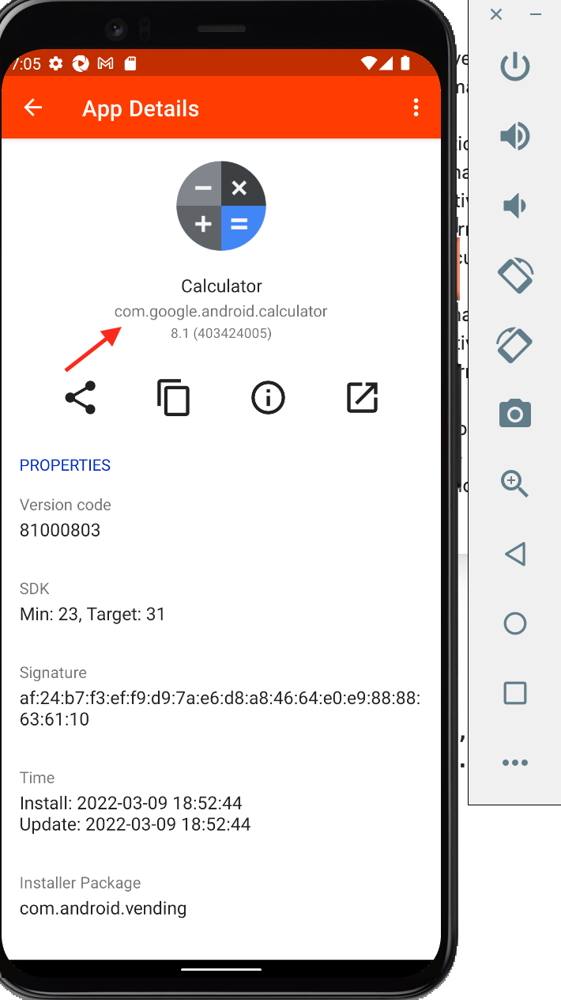
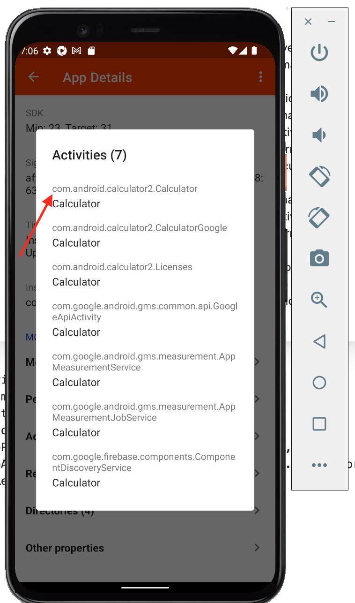

# Ejemplo-04 # - Ejecución del primer tests automatizado sobre el emulador de android

## Objetivo

- Adaptar los scripts de pruebas de automatizaciones Web a script de pruebas que puedan ser ejecutados en plataformas móviles.

## Desarrollo


#### :round_pushpin: Configurar Capabilities

Lo primero que debemos realizar para poder iniciar con las automatizaciones en dispositivos moviles es obtener la informacion de los `Desired Capabilities` que debemos configurar en los scripts de pruebas.

Antes de ver cuales son las `capabilities` minimas que requerimos para hacer funcionar nuestros script de pruebas es necesario saber lo que existen 2 formas de localizar una app:

1. `Teniendo una aplicacion (.apk)`: si vamos el `prework`veremos un ejemplo de este caso, donde se explico como descargar la apk de la calculadora de android. Para este caso basta con configurar las siguientes `Desired Capabilities`:

    ```Json
    {
    "appium:deviceName": "emulator-5554",
    "platformName": "android",
    "appium:platformVersion": "12",
    "appium:automationName": "uiautomator2",
    "appium:app": "/Users/Downloads/Calculator.apk"
    }
    ```
    __Donde:__

    - `deviceName`: El tipo de dispositivo móvil o emulador a usar. Se obtiene al abrir la terminal, posicionarte en la ruta de ANDROID_HOME e ingresar `adb devices`
    - `platformName`: plataforma de sistema operativo móvil a usar (iOS, Android o FirefoxOS)
    - `platformVersion`: versión del SO del dispositivo.
    - `automationName`: motor de automatización a usar, depende del SO, para android puede ser `UIAutomator1` o `UIAutomator2` depende de la versión, `UIAutomator1`se utiliza en versiones mayores a Android 5 por ejemplo.
    - `app`: ubicacion donde se encuentra la `.apk`


2. `Bajando una aplicacion desde el play store` de los dispositivos moviles: abres el play store del dispositivo fisico o virtual y buscas y decargas la aplicación.

    ```Json
    {
    "appium:deviceName": "emulator-5554",
    "platformName": "android",
    "appium:platformVersion": "12",
    "appium:automationName": "uiautomator2",
    "appium:appPackage": "com.google.android.calculator",
    "appium:appActivity": "com.android.calculator2.Calculator"
    }
    ```

    __Donde:__

    - `appActivity`: Nombre de actividad para la actividad de Android que desea iniciar desde su paquete.
    - `appPackage`: Paquete Java de la aplicación de Android que desea ejecutar.

#### Pero ... ¿Como obtener la información del `appActivity`y `appPackage` de una aplicación?

1. Descargar en el dispositivo fisico o virtual la palicación `apk info` del play store.
2. Abrir la aplicación y buscar en la lista de aplicación la que queremos probar.
3. En la pantalla principal veremos el `appPackage`

     

4. Ir a la seccion de `activities` y veremos el nombre de la actividad.

     


En la [`Sesión 08:` Appium: Primeros pasos](./Sesion-08) veremos con mayor profundidad sobre los `Desired Capabilities`


